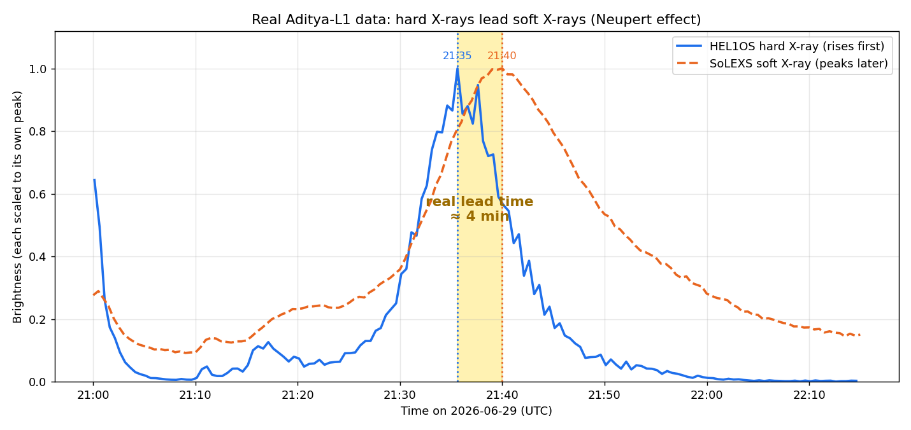

# Solar Flare Forecasting & Nowcasting with Aditya-L1

Our entry for **ISRO Bharatiya Antariksh Hackathon 2026, Problem Statement 15** — detecting and forecasting solar flares from the combined soft and hard X-ray data of Aditya-L1 (SoLEXS + HEL1OS).

This repository holds the code and results we built ourselves while working on the idea. Everything here was run on **real Aditya-L1 data from ISRO's PRADAN portal**, not on synthetic examples.

---

## What this does

- **Reads** Aditya-L1 HEL1OS and SoLEXS files (and Chandrayaan-2 XSM / GOES), including light curves, spectra, and event lists.
- **Detects** flares with an adaptive-background method that works across the full A-to-X brightness range.
- **Builds a unified flare catalog** by time-matching detections from different detectors.
- **Extracts physical features** from the spectra — a real-energy temperature and a hardness ratio for each flare.
- **Measures the hard-to-soft lead time**, which is the basis of our forecasting idea.

---

## What we already found (on real data)

- Detected **11 flares** in a single 12-hour HEL1OS window; both detectors agreed on every one.
- Estimated flare **temperatures of 20–33 MK** from the spectra, which is what we expect for these flares.
- On the **29 June 2026 flare**, the hard X-rays peaked at **21:35 UTC** and the soft peak came at **21:39 UTC** — a real **~4-minute lead time** (the Neupert effect), measured on Aditya-L1 data.



See the `results/` folder for the flare detection plot, the temperature spectrum, and the flare catalog CSVs.

---

## How to run it

```bash
pip install -r requirements.txt

# analyze a single file or a whole folder of Aditya-L1 / GOES data
python src/aditya_flare_tool.py path/to/data_folder/

# for GOES flux data, add --flux to get A/B/C/M/X classes
python src/aditya_flare_tool.py goes_xray.csv --flux
```

It auto-detects light curves, spectra, and event lists. For event files it also fits a temperature per flare. Full instructions: [docs/HOW_TO_USE.md](docs/HOW_TO_USE.md).

There is also a **Google Colab notebook** in `notebooks/` if you prefer to upload files and see the plots in your browser.

### Getting the data
The Aditya-L1 SoLEXS and HEL1OS Level-1 products are free from ISRO's PRADAN portal (https://pradan.issdc.gov.in/). Chandrayaan-2 XSM and GOES are also open. The raw data is not stored in this repo because of its size.

---

## Honest limitations

We read the literature and know where flare forecasting is hard. We do not claim to solve it; we aim to do a careful, measurable slice of it.

- Operational forecasts today are often poorly calibrated and produce many false alarms (Camporeale et al., *Space Weather*, 2025). We evaluate with **TSS/HSS**, not plain accuracy.
- The exact trigger moment of a flare is not fully understood (solar-flare prediction review, 2025). We output a **probability**, not a yes/no.
- Flare data is very imbalanced, roughly 1 X : 10 M : 100 C. We **weight rare flares** and never report accuracy alone.
- An exact temperature needs the instrument response files (RMF/ARF), which we did not have. Our temperatures are **first-order estimates**.

---

## Repository layout

```
src/          the analysis tool (single Python file)
notebooks/    Google Colab notebook version
results/      real-data plots and the flare catalog we produced
docs/         usage guide + our physics and solution notes
```

## Tools
Python, astropy, sunpy, numpy, pandas, matplotlib (analysis); XGBoost / scikit-learn + SHAP planned for the forecaster; FastAPI + a light dashboard for the operational layer.

## License
MIT — see [LICENSE](LICENSE).
